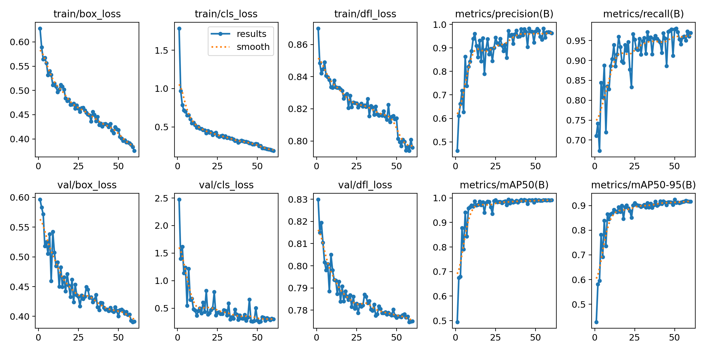

# 💰 Coin Detection using YOLO11s

## 📌 Project Description
This project implements a real-time **Object Detection** system to recognize and classify various types of US Coins. Powered by **YOLO11s** (the latest lightweight version of the YOLO architecture), the model is highly accurate and capable of detecting coins even when they are clustered, overlapping, or placed in complex angles.

### 🪙 Detected Classes:
* **Penny**
* **Nickel**
* **Dime**
* **Quarter**

---

## 🚀 Visual Results
Below are the inference results of the trained model on random images from the test dataset:

<!-- REPLACE 'results.jpg' WITH YOUR ACTUAL GRID IMAGE FILENAME -->

> **Analysis:** The model demonstrates an average confidence score of over **90%**, with highly precise bounding boxes tightly fitting each coin.

---

## ✨ Features
* **Latest Model Architecture:** Utilizes YOLO11s for a perfect balance between high-speed inference and exceptional accuracy.
* **High Precision:** Successfully distinguishes between visually similar coin types (e.g., Dime vs. Quarter).
* **Robustness:** Performs well under various lighting conditions and tricky object placements.
* **Automated Pipeline:** Features automated scripts for train/val data splitting and dynamic `data.yaml` generation.

---

## 🛠️ Tech Stack & Requirements
* **Language:** Python 3.x
* **AI Framework:** [Ultralytics YOLO](https://github.com/ultralytics/ultralytics)
* **Data Processing:** OpenCV, Pandas, PyYAML
* **Visualization:** Matplotlib
* **Infrastructure:** Google Colab (Tesla T4 GPU)

---

## 📂 Implementation Details
1.  **Dataset Preparation:** Downloaded and extracted the annotated US Coins dataset.
2.  **Preprocessing:** Applied a custom `train_val_split.py` script to split the dataset into 90% Training and 10% Validation sets.
3.  **Configuration:** Dynamically generated the `data.yaml` file based on the dataset's `classes.txt`.
4.  **Training:** Fine-tuned the pre-trained YOLO11s model for **60 epochs** at a **640px** image resolution.
5.  **Inference:** Evaluated the best model weights (`best.pt`) on unseen test images to generate bounding boxes and confidence scores.
